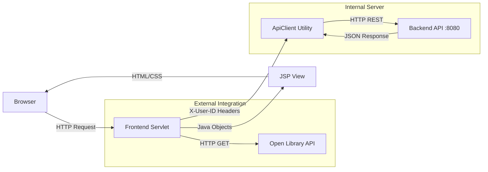

# 📚 The Knowledge Nexus - Library Frontend


**The Knowledge Nexus** is a premium, server-side rendered frontend application for a Library Management System. Built with Java Servlets and JSP, it features a stunning **Dark Glassmorphism UI** and integrates directly with global book repositories.

---

## ✨ Key Features

### 👤 For Users
*   **Nebula Glass UI:** An immersive, high-performance interface with real-time feedback.
*   **Global Search:** Integrated **Open Library API** allowing users to search millions of books beyond the local collection.
*   **My Shelf:** A dedicated tab to manage currently borrowed books with one-click returns and visual cover art.
*   **Book Requests:** Request new books directly from global search results if they aren't available locally.
*   **Borrow History:** Complete timeline of past and present loans with intelligent status tracking.
*   **Visual Catalog:** Automated book cover fetching using the **Open Library Covers API**.

### 🛡️ For Administrators
*   **Command Center:** A real-time dashboard with system statistics (Total Users, Books, Active Loans).
*   **API Monitor:** Live health check for external API dependencies (Open Library connectivity status).
*   **Request Management:** Review and Approve/Reject community book requests with automated local catalog integration.
*   **Inventory Control:** Full CRUD capabilities with robust error handling and multi-method deletion fallbacks.
*   **User Registry:** Complete control over user accounts, roles, and system access.

---

## 🏗️ Architecture

This project follows a **Proxy-MVC Pattern**. The Frontend Server handles all UI/UX logic and delegates data persistence to a separate Backend API using a custom `ApiClient`.



### 🔐 Security & Headers
The application uses custom headers for administrative verification:
*   **X-User-ID:** Automatically injected into requests to ensure the backend can verify Admin privileges for sensitive operations.

---

## 🚀 Getting Started

### Prerequisites
*   **Java JDK 17+**
*   **Maven** (Wrapper included)
*   **Backend Service:** Must be running on `http://localhost:8080` (or configured port).

### Installation

1.  **Clone the Repository**
    ```bash
    git clone https://github.com/yourusername/library-frontend.git
    cd library-frontend
    ```

2.  **Configure Backend URL**
    If your backend runs on a different port, update `src/main/java/com/eswar/library/util/ApiClient.java`:
    ```java
    private static final String BASE_URL = "http://127.0.0.1:8080/api";
    ```

3.  **Build and Run**
    ```bash
    ./mvnw clean package
    # Deploy the generated WAR file to your application server (Tomcat 10+)
    ```

---

## 📂 Project Structure

```
src/main/
├── java/com/eswar/library/
│   ├── model/         # Models (Book, User, Borrow, BookRequest, ExternalBook)
│   ├── util/          # ApiClient (Header-aware HTTP Client)
│   └── web/           # Controllers (Dashboards, Search, Requests, Admin Servlets)
└── webapp/
    ├── css/           # Design System (style.css)
    ├── jsp/           # Premium Views (Glassmorphism Layouts)
    └── WEB-INF/       # Deployment Descriptors
```

---

## 🛠️ Tech Stack

*   **Language:** Java 17
*   **Web Framework:** Jakarta Servlet 6.0 & JSP 3.0
*   **API Integrations:** Open Library (Search & Covers)
*   **JSON Engine:** Google Gson
*   **Icons:** Remix Icon (CDN)
*   **Build Tool:** Apache Maven

---

## 📜 License

This project is open-source and available under the [MIT License](LICENSE).