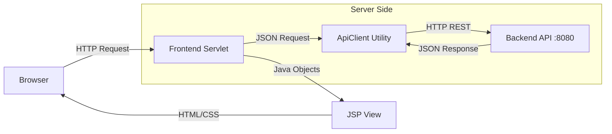

# 📚 The Knowledge Nexus - Library Frontend


**The Knowledge Nexus** is a modern, server-side rendered frontend application for a Library Management System. Built with Java Servlets and JSP, it features a stunning **Dark Glassmorphism UI** and acts as a robust proxy to a RESTful backend.

---

## ✨ Key Features

### 👤 For Users
*   **Immersive Dashboard:** A responsive, grid-based view of the library catalog.
*   **Real-time Availability:** Instant visual feedback on book stock (Available vs. Out of Stock).
*   **Smart Borrowing:** Prevents duplicate borrowing of the same title (Business Rule Enforcement).
*   **Personal Bookshelf:** Sidebar view of active loans and complete borrowing history.
*   **Search:** Instant filtering by title or author.

### 🛡️ For Administrators
*   **Admin Portal:** Dedicated secure area for management tasks.
*   **Book Inventory:** Full CRUD (Create, Read, Update, Delete) capabilities for the library catalog.
*   **User Management:** Promote/demote users and manage access.
*   **Visual Badges:** distinct UI indicators for User roles and Book status.

---

## 🏗️ Architecture

This project follows a **Proxy-MVC Pattern**. The Frontend Server handles all UI/UX logic and delegates data persistence to a separate Backend API.



*   **Controller:** Java Servlets (`DashboardServlet`, `AdminBooksServlet`) handle routing and logic.
*   **View:** JSPs render the HTML on the server, ensuring fast initial loads and SEO friendliness.
*   **Model:** `ApiClient` creates a bridge to the backend, mapping JSON to Java POJOs using GSON.

---

## 🚀 Getting Started

### Prerequisites
*   **Java JDK 17+**
*   **Maven** (Wrapper included)
*   **Backend Service:** Must be running on `http://localhost:8080` (or configured port).

### Installation

1.  **Clone the Repository**
    ```bash
    git clone https://github.com/yourusername/library-frontend.git
    cd library-frontend
    ```

2.  **Configure Backend URL**
    If your backend runs on a different port, update `src/main/java/com/eswar/library/util/ApiClient.java`:
    ```java
    private static final String BASE_URL = "http://127.0.0.1:8080/api";
    ```

3.  **Build and Run**
    Using Maven (if configured with Jetty/Tomcat plugin) or your IDE (IntelliJ/Eclipse):
    ```bash
    ./mvnw clean install
    # Deploy the generated WAR file to your Tomcat server
    ```

4.  **Access the App**
    Open your browser to: `http://localhost:8081/library_frontend_war/` (Port depends on your local server settings).

---

## 📂 Project Structure

```
src/main/
├── java/com/eswar/library/
│   ├── model/         # POJOs (Book, User, Borrow)
│   ├── util/          # ApiClient & Helpers
│   └── web/           # Servlets (Controllers)
└── webapp/
    ├── css/           # Global Styles (style.css)
    ├── jsp/           # Views (dashboard.jsp, admin_*.jsp)
    └── WEB-INF/       # Web Configuration
```

---

## 🛠️ Tech Stack

*   **Language:** Java 17
*   **Web Framework:** Jakarta Servlet & JSP
*   **HTTP Client:** Java 11 `HttpClient`
*   **JSON Parsing:** Google Gson
*   **Styling:** CSS3 (Variables, Flexbox, Grid)
*   **Build Tool:** Apache Maven

---

## 📜 License

This project is open-source and available under the [MIT License](LICENSE).
